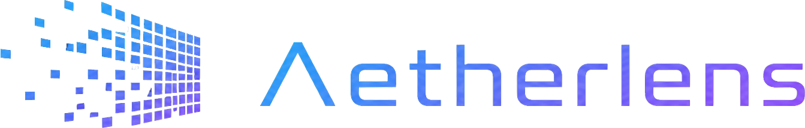

<div align="center">
  
  <p><strong>Lenticular print pattern generator</strong></p>
  <p>
    <a href="https://aetherxrlab.github.io/aetherlens/">
      
    </a>
    
    
  </p>
</div>

## What is this?

**Aetherlens** generates ready-to-print interleaved patterns for **LPI lenticular sheets** — those plastic cards/films that show different images depending on viewing angle.

Upload 2 or 3 source images, set your sheet's LPI and DPI, and get a single PNG that you can print and mount onto a lenticular sheet to create:

- **2-flip** — two-image switching (wink, before/after, day/night)
- **3-flip** — three-image rotation (animation frames, or left/center/right for basic 3D)

[**Try it now →**](https://aetherxrlab.github.io/aetherlens/)

---

## Features

- **Precise interlacing** at any LPI/DPI — fractional pitch supported
- **7 languages**: 日本語 · 한국어 · English · Français · ไทย · 繁體中文 · 简体中文
- **Built-in image editor** per source — rotate, scale, pan, **crop**, with ghost-overlay alignment to perfectly register multiple frames
- **LPI calibration** test pattern to discover your sheet's true LPI (often ±0.3 off the nominal value)
- **Bleed + crop marks** for trimming after print
- **DPI metadata embedded in PNG** (pHYs chunk) — Photoshop / Acrobat / RIP software will respect the physical size automatically
- **Multi-image layout** — fit copies onto A4 / A3 / custom paper, mix different designs on one sheet, click to remove
- **UV printer ready** — full alpha preservation so transparent areas stay transparent for proper white-ink layer handling
- **100% client-side** — your images never leave your browser. No backend, no uploads, no analytics

## Quick start

1. Open https://aetherxrlab.github.io/aetherlens/
2. Pick your language
3. Set **LPI** to match your lenticular sheet (typically 50 or 75)
4. Set **DPI** to your printer's actual resolution (600 or 1200 is enough for most cases)
5. Upload 2 or 3 source images
6. Optionally adjust position / rotation / crop per image (Step 3) using the ghost-overlay editor to align subjects between frames
7. Click **Generate** → **Download PNG**
8. Print at **100% / actual size** — never "fit to page"
9. Mount onto the lenticular sheet, lens-side out

> [!TIP]
> Run the **LPI Calibration** tool first (built-in second tab). Print the test image, view through your sheet, and find the row that looks cleanest gray (no rainbow patterns) — that's your sheet's true LPI. Use the calibrated value when generating the actual pattern for visibly better effect.

## Tech

- Single HTML file (~190 KB) with embedded CSS/JS
- Vanilla JavaScript — no framework, no build step, no `npm install`
- Canvas 2D API for image processing
- File API + Blob API for upload/download
- PNG `pHYs` chunk injection for accurate DPI metadata
- LocalStorage for language preference

## Self-host / Embed

It's a single static HTML file. Two ways to use it on your own:

```bash
# Clone and serve from any static host (Nginx, S3, OSS, GitHub Pages, etc.)
git clone https://github.com/AetherXRLab/aetherlens.git
```

Or embed in your existing site:

```html
<iframe src="https://aetherxrlab.github.io/aetherlens/lenticular.html"
        width="100%" height="900"
        style="border:0;border-radius:12px"></iframe>
```

## License

MIT — see source for full terms. Free for personal and commercial use.
